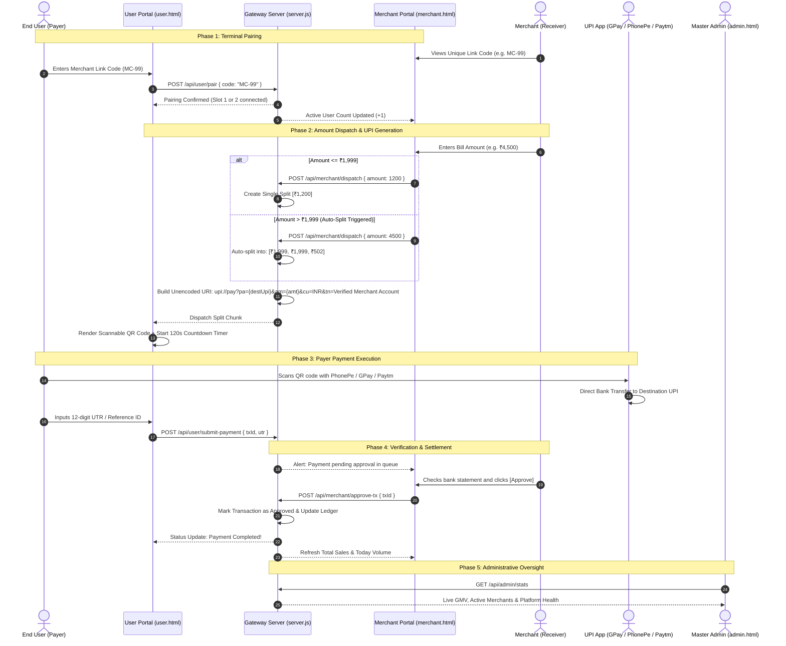

# 💳 Multi-Tier UPI Payment Gateway System (Merchant, User & Admin)

An end-to-end, multi-portal web architecture designed to streamline merchant onboarding, dynamic UPI QR generation, payment splitting, and real-time transaction approvals with administrative oversight.

---

## 🌟 Key Features

* **3-Tier Architecture:** Separate, specialized portals for **Admins**, **Merchants**, and **Users**.
* **Pre-Registration Demo Mode:** Instant sandbox preview for merchants to explore dashboard functionality prior to registration.
* **Onboarding & Gateway Activation:** Multi-step merchant registration with gateway selection (Paytm Live) and 100% free, immediate gateway activation.
* **Smart UPI Splitting Engine:** Automatically splits transaction amounts exceeding **₹1,999** into compliant chunks (e.g., ₹4,500 ➔ ₹1,999 + ₹1,999 + ₹502) to prevent transaction limit rejections.
* **Dynamic UPI QR Generation:** Converts split payloads into standard scannable `upi://pay` URIs formatted with unencoded parameters (`@` and spaces) for direct, zero-error execution across all UPI apps (PhonePe, Google Pay, Paytm, BHIM).
* **2-Minute Expiration Timer:** Real-time 120-second countdown on user payment QR codes to enforce transaction security and prevent stale requests.
* **Merchant-User Pairing:** Dynamic connection linking a unique merchant code (e.g., `MC-99`) with up to **2 concurrent active users**.
* **Manual Verification Controls:** Real-time **Approve / Deny** transaction management for merchants with instant sales statistics updates.
* **Master Administrative Oversight:** Full admin capabilities to inspect merchant accounts, manage custom credentials, toggle **Active/Blocked** statuses, delete accounts, and purge fake/test data.

---

## 🏗️ System Architecture & Workflow

### 1. 🏪 Merchant Portal (`merchant.html`)
- **Demo Sandbox:** Allows non-registered users to test the interface without creating an account using demo code `MC-99`.
- **Multi-Step Onboarding:**
  1. Phone number and password setup.
  2. Gateway selection (**Paytm** LIVE; GPay, PhonePe, and others marked *Coming Soon*).
  3. Destination UPI ID configuration (direct mapping to merchant bank VPA).
  4. Instant zero-fee gateway activation.
- **Amount Dispatch Engine:** Accepts transaction amounts, checks against the ₹1,999 threshold, applies auto-splitting, and dispatches dynamic UPI payloads sequentially to connected users.
- **Live Dashboard:** Displays total sales analytics, paired user counts, destination UPI settings, and an active queue for manual payment approvals.

### 2. 📱 User Portal (`user.html`)
- **Light Blue Custom UI:** Modern, clean, high-contrast light-blue input container designed for optimal mobile and desktop responsiveness.
- **Code Pairing:** Users connect directly to a merchant terminal using the merchant's **Unique Link Code** (e.g., `MC-99`).
- **Dynamic QR & Timer Display:** Renders the dynamic UPI QR code (`upi://pay?pa=...&am=...&cu=INR&tn=Verified Merchant Account`) along with an active 2-minute countdown timer.
- **Auto-Expiration:** Automatically invalidates QR codes after 120 seconds if unfulfilled.
- **Payment Confirmation:** Users submit their UTR / transaction reference number to request approval from the merchant.

### 3. 🛡️ Master Admin Portal (`admin.html`)
- **Centralized Directory:** Full view of all registered merchants, phone numbers, mapped UPI IDs, linked codes, and account statuses.
- **Account Moderation:** One-click toggling between **Active** and **Blocked** states to freeze suspended merchants.
- **Merchant Management:** Delete inactive or test merchants with a single click.
- **Admin Credential Controls:** Update admin username and password via top navigation modal or inline security panel.
- **Data Hygiene:** 1-click **Clear Fake Data** button to purge mock records and reset platform sales metrics safely.

---

## 🔄 End-to-End Payment Sequence

The system supports two checkout workflows depending on the transaction value: **Standard Single Payment (≤ ₹1,999)** and **Smart Split Payment (> ₹1,999)**.

### Sequence Diagram



---

### Step-by-Step Execution Workflow

1. **Terminal Pairing:**
   - The merchant displays their terminal link code (e.g., `MC-99`) to the customer.
   - The user opens `user.html`, enters the link code, and immediately pairs with the merchant terminal. Up to 2 concurrent users can pair with a single merchant.

2. **Amount Input & Threshold Evaluation:**
   - The merchant enters the transaction amount in their portal.
   - If the amount is **≤ ₹1,999**, a single payment payload is constructed.
   - If the amount is **> ₹1,999**, the **Splitting Engine** computes chunks of ₹1,999 max and a remainder chunk (e.g., ₹4,500 ➔ ₹1,999 + ₹1,999 + ₹502).

3. **Standardized UPI URI Assembly:**
   - The server constructs the payment URI according to NPCI specifications:
     ```text
     upi://pay?pa=paytm.s1m66cw@pty&am=598&cu=INR&tn=Verified Merchant Account
     ```
   - Parameters maintain literal `@` and natural spaces without percent-encoding to ensure 100% interoperability across all mobile UPI scanners.

4. **Dynamic QR Presentation & Security Countdown:**
   - The paired user portal receives the payload and renders a QR code via `qrcode.min.js`.
   - A strict **120-second (2-minute) countdown timer** initiates.
   - If unpaid within 120 seconds, the QR expires automatically to prevent transaction collisions.

5. **Customer Payment & UTR Submission:**
   - The customer scans the QR code with any UPI app (Paytm, Google Pay, PhonePe, BHIM, Cred) and completes the pin-authorized bank transfer.
   - The customer inputs the 12-digit UTR (Unique Transaction Reference) into the user portal and clicks **Submit Payment**.

6. **Real-Time Merchant Verification:**
   - The transaction enters the merchant's **Pending Approvals Queue**.
   - The merchant cross-checks the credit alert or bank notification and clicks **Approve** (or **Deny**).
   - Upon approval, the user portal shows a green **Payment Confirmed** state, and the merchant's **Total Sales** counter increments in real time.

7. **Multi-Chunk Sequential Handling (for split transactions):**
   - If multiple chunks exist, once chunk #1 is approved, the system dispatches chunk #2 immediately to the paired user until the full order amount is fulfilled.

---

## 📡 API Endpoints Reference

### Merchant Endpoints
| Method | Endpoint | Description |
| :--- | :--- | :--- |
| `POST` | `/api/merchant/register` | Register a new merchant (100% free onboarding) |
| `POST` | `/api/merchant/login` | Authenticate merchant and issue session |
| `POST` | `/api/merchant/dispatch` | Push amount and generate split UPI chunks |
| `POST` | `/api/merchant/update-upi` | Update merchant destination UPI VPA |
| `POST` | `/api/merchant/approve-tx` | Approve pending transaction by ID |
| `POST` | `/api/merchant/reject-tx` | Reject/deny invalid transaction |

### User Endpoints
| Method | Endpoint | Description |
| :--- | :--- | :--- |
| `POST` | `/api/user/pair` | Pair user session with merchant link code |
| `GET`  | `/api/user/poll` | Long-poll / fetch dispatched QR payload |
| `POST` | `/api/user/submit-payment`| Submit 12-digit UTR after payment |

### Admin Endpoints
| Method | Endpoint | Description |
| :--- | :--- | :--- |
| `POST` | `/api/admin/login` | Authenticate admin |
| `GET`  | `/api/admin/stats` | Retrieve total platform GMV and counts |
| `GET`  | `/api/admin/merchants` | List all registered merchants |
| `POST` | `/api/admin/merchants/:id/toggle` | Toggle Active / Blocked merchant status |
| `POST` | `/api/admin/merchants/:id/reset-pw` | Admin-initiated password reset |
| `DELETE`| `/api/admin/merchants/:id` | Delete merchant account |
| `POST` | `/api/admin/update-credentials` | Change admin username and password |
| `POST` | `/api/admin/clear-fake-data` | Wipe test data and reset platform statistics |

---

## 💻 Tech Stack

- **Backend:** Node.js, Express.js, `cors`, `body-parser`
- **Database:** Local JSON-backed persistence store (`data/database.json`) with atomic writes
- **Frontend:** Vanilla HTML5, CSS3, JavaScript (ES6+)
- **Styling:** Custom light-blue responsive theme, Flexbox/CSS Grid, high-contrast inputs
- **QR Generation:** Client-side dynamic QR generation via `qrcode.min.js`

---

## 🚀 Getting Started

### 1. Prerequisites
- [Node.js](https://nodejs.org/) (v16 or higher recommended)
- `npm` (included with Node.js)

### 2. Installation
```bash
# Clone or navigate to the project directory
cd upi-merchant-system

# Install dependencies
npm install
```

### 3. Start the Server
```bash
npm start
# or: node server.js
```
The application will launch on `http://localhost:3000`.

### 4. Portal URLs
- **Main Hub:** `http://localhost:3000/`
- **Merchant Portal:** `http://localhost:3000/merchant.html` (or `/merchant/`)
- **User Payment Terminal:** `http://localhost:3000/user.html` (or `/user/`)
- **Master Admin Dashboard:** `http://localhost:3000/admin.html` (or `/admin/`)

---

## 🔒 Security & Best Practices

- **Zero URL Encoding on UPI VPAs:** Prevents `%40` encoding bugs in mobile UPI app parsers.
- **Strict 2-Minute Expiry:** QR codes are invalidated after 120 seconds to prevent unauthorized delayed claims.
- **Manual Proof Verification:** Requires merchant confirmation of UTR numbers before crediting balances.
- **Custom Admin Access:** Full administrative credential rotation and instant account suspension controls.

---

## 📄 License
MIT License. Open for development, testing, and production deployment.
